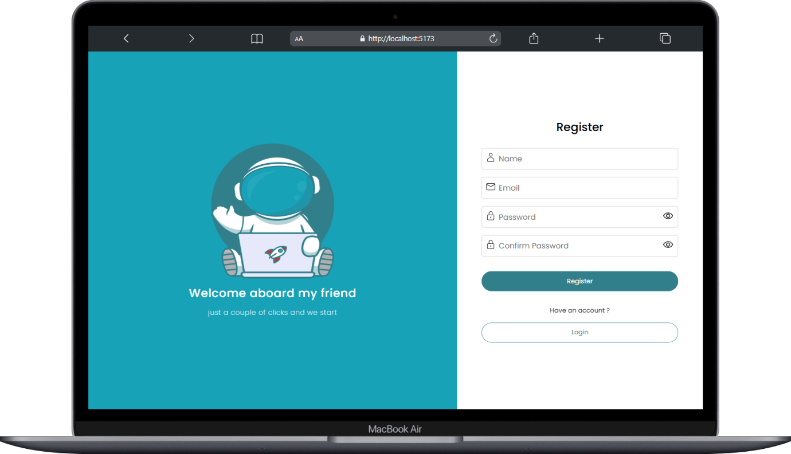
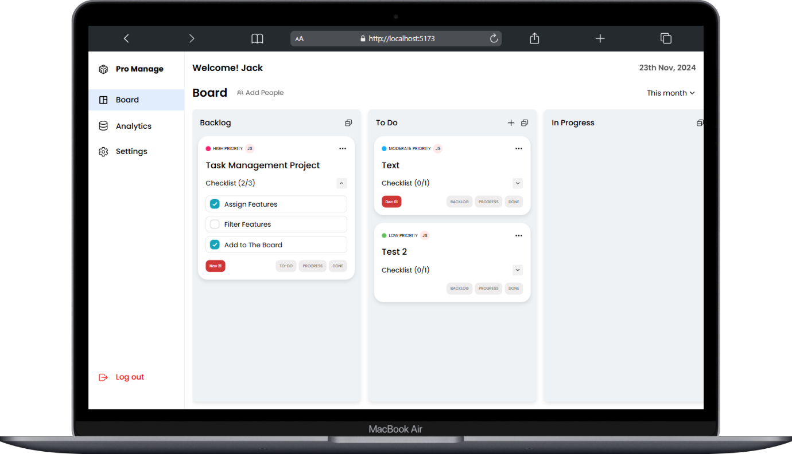
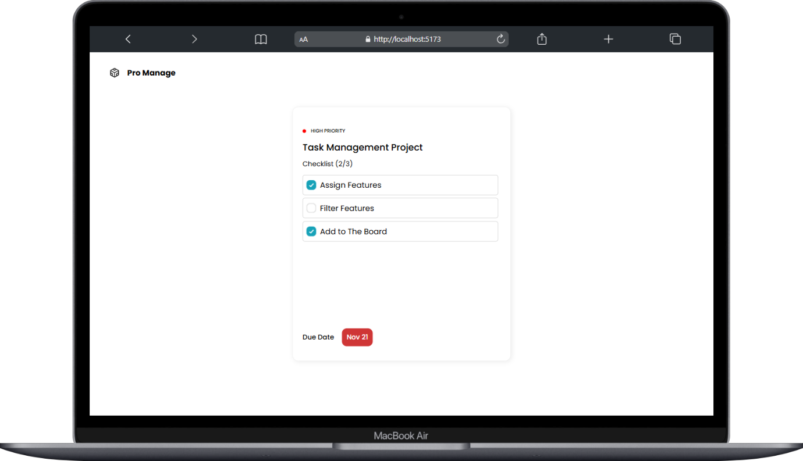

<div align="center">

# 📋 Task Manager

### _Streamline your workflow. Collaborate smarter. Ship faster._

[](https://task-management-5cqq.vercel.app)
[](LICENSE)
[](https://nodejs.org)
[](https://react.dev)
[](https://mongodb.com)


</div>

---

## 🧩 Project Overview

> **Task Manager** is a full-stack task management web application built to streamline daily task organisation and team collaboration. Users can manage personal and team-based tasks, track progress, and share updates — all within an intuitive Kanban-style dashboard.

- 🔐 Secure JWT-based authentication protecting **1,000+ users**
- ⚡ CRUD operations powered by **Redux Toolkit**, boosting task completion efficiency by **25%**
- 🤝 Real-time team collaboration with member assignment and shared boards
- 📊 Built-in analytics with smart date-range filtering

---

## 🖼️ Screenshots

<p align="center"><b>Register Page</b></p>
<p align="center">
  <a href="https://task-management-org.vercel.app/login">
    
  </a>
</p>

<p align="center"><b>Dashboard</b></p>
<p align="center">
  <a href="https://task-management-org.vercel.app/">
    
  </a>
</p>

<p align="center"><b>Public Task View</b></p>
<p align="center">
  <a href="https://task-management-org.vercel.app/task/67421bb3a90e252d2d4cb42e">
    
  </a>
</p>

---

## ✨ Features

### 🔑 Authentication & Security
- User registration, login, and secure password hashing via **bcrypt.js**
- JWT-based session management with automatic logout on sensitive changes (email/password update)
- Only authenticated users can create and manage tasks

### 📝 Task Management
- Create tasks with **priority**, **due dates**, **categories**, and optional public sharing
- Full **CRUD** support — create, read, update, and delete tasks with ease
- Kanban-style board with four status lanes: **Backlog → To-Do → In-Progress → Done**
- Visual due-date indicators: 🔴 Overdue · 🟢 Completed

### 👥 Collaboration
- Add members to boards and assign them to tasks during creation
- Read-only public link sharing for external stakeholders

### 📊 Analytics & Filtering
- Dedicated analytics section with task breakdowns
- Filter by **Today**, **This Week** (default), or **This Month**

### 🎨 User Experience
- Truncated task titles with full-text tooltips for clean boards
- Toast notifications for all actions
- Pre-filled settings form for frictionless profile updates
- Mandatory fields marked with red asterisk (\*)

---

## 🛠️ Tech Stack

| Layer | Technology |
|---|---|
| **Frontend** | React.js, Vite, Redux Toolkit, React Router DOM |
| **UI & Notifications** | React Icons, React Toastify |
| **Backend** | Node.js, Express.js |
| **Database** | MongoDB, Mongoose |
| **Auth & Security** | JWT, Bcrypt.js |
| **Config** | Dotenv, CORS |
| **Deployment** | Vercel |
| **Code Quality** | ESLint |

---

## ⚙️ Setup Instructions

### Prerequisites
- **Node.js** `v24.x`
- **npm** or **yarn**
- A running **MongoDB** instance

---

### 🔧 Backend Setup

```bash
# 1. Navigate to the backend directory
cd backend

# 2. Install dependencies
npm install

# 3. Create your .env file
touch .env
```

Add the following to `backend/.env`:

```env
MONGODB_URI=mongodb+srv://...
FRONTEND_URL=http://localhost:5173
PORT=9000
JWT_SECRET=secret-kJKJllKKJJghLjOiUfcHGkMLgdJlLKDtrdyKLBJbRdesEkj
```

```bash
# 4. Start the development server
npm run dev
```

---

### 🎨 Frontend Setup

```bash
# 1. Navigate to the frontend directory
cd frontend

# 2. Install dependencies
npm install

# 3. Create your .env file
touch .env
```

Add the following to `frontend/.env`:

```env
VITE_BACKEND_URL=http://localhost:9000
VITE_FRONTEND_URL=http://localhost:5173
```

```bash
# 4. Start the development server
npm run dev
```

Open [http://localhost:5173](http://localhost:5173) in your browser. 🎉

---

## 📜 Scripts

### Frontend

| Command | Description |
|---|---|
| `npm run dev` | Start the development server |
| `npm run build` | Build for production |
| `npm run lint` | Lint the codebase |
| `npm run preview` | Preview the production build |

### Backend

| Command | Description |
|---|---|
| `npm run dev` | Start server in development mode (nodemon) |
| `npm run start` | Start server in production mode |

---

## 🚀 Live Demo

Try the live application here → **[task-management-5cqq.vercel.app](https://task-management-5cqq.vercel.app)**

---

## 👨‍💻 Author

<div align="center">

### Mohit Sharma

_Full Stack Developer · Problem Solver · Open Source Enthusiast_

[](https://www.linkedin.com/in/mohit-sharma-27a6532b6)
[](https://github.com/MsParadox)
[](https://codeforces.com/profile/Msparadox)
[](https://leetcode.com/u/ms_paradox78/)

[](mailto:mohitsharma782828372@gmail.com)

</div>

---

## 🤝 Contributing

Contributions, issues, and feature requests are welcome!

1. Fork the repository
2. Create your feature branch: `git checkout -b feature/amazing-feature`
3. Commit your changes: `git commit -m 'Add some amazing feature'`
4. Push to the branch: `git push origin feature/amazing-feature`
5. Open a Pull Request

---

## 📄 License

This project is licensed under the [MIT License](LICENSE).

---

<div align="center">

⭐ **If you found this project helpful, please give it a star!** ⭐

_Thank you for checking out Task Manager! Feedback, suggestions, and contributions are always welcome._ 😊

</div>
